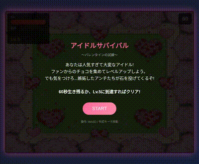

# アイドルサバイバル〜バレンタインの試練〜
## Idol Survival: Valentine's Trial



あなたは人気すぎて大変なアイドル!
ファンからのチョコを集めてレベルアップしよう。
でも気をつけろ...嫉妬したアンチたちが石を投げてくるぞ!

## Play

https://rsasaki0109.github.io/idol_survival_valentine/

## How to Play

### Controls
| Key | Action |
|-----|--------|
| W / ↑ | Move Up |
| A / ← | Move Left |
| S / ↓ | Move Down |
| D / → | Move Right |

### Rules
- **HP**: 100 (Stone hits deal 25 damage)
- **EXP**: Collect chocolates for +25 EXP each
- **Level Up**: Lv.1 → Lv.5 (MAX)

### Win Conditions
- Survive for 60 seconds
- Reach Level 5

### Lose Condition
- HP reaches 0

## Characters

| Character | Description |
|-----------|-------------|
| Player | Popular idol trying to survive |
| Fan NPC | Throws chocolates every 3 seconds |
| Anti NPC | Throws stones every 2 seconds (jealous!) |

## Local Development

```bash
# Clone the repository
git clone https://github.com/rsasaki0109/idol_survival_valentine.git
cd idol_survival_valentine

# Start local server
python3 -m http.server 8888

# Open in browser
# http://localhost:8888
```

## License

MIT
